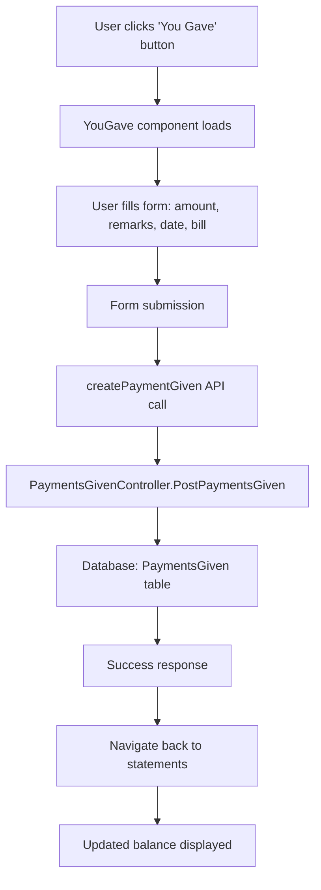
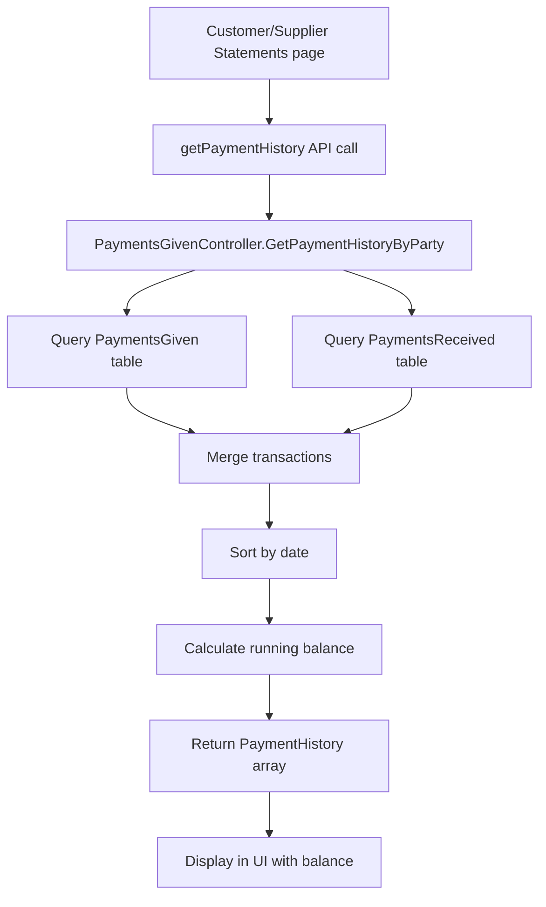

# You Gave & You Received Logic Analysis

## Overview

The "You Gave" and "You Received" system is a core feature of the Point of Sale application that tracks financial transactions between the business and its customers/suppliers. This system implements a traditional Indian business accounting concept known as "Khata" (ledger) where transactions are recorded as either money given or money received.

---

## Business Logic Flow

### 1. **Transaction Types**

#### **"You Gave" (Payments Given)**
- **Meaning**: Money given by the business to a customer/supplier
- **Examples**: 
  - Advance payment to supplier
  - Refund to customer
  - Loan given to customer
  - Payment for services received
- **Impact**: **Decreases** the balance (business owes less or customer owes more)

#### **"You Received" (Payments Received)**
- **Meaning**: Money received by the business from a customer/supplier
- **Examples**:
  - Payment from customer for goods/services
  - Collection of outstanding dues
  - Advance payment from customer
  - Refund received from supplier
- **Impact**: **Increases** the balance (business owes more or customer owes less)

### 2. **Balance Calculation Logic**

```typescript
// Balance calculation algorithm
let currentBalance = 0;

// For each transaction in chronological order:
if (transaction.type === "Given") {
    currentBalance -= transaction.amount;  // Decrease balance
} else if (transaction.type === "Received") {
    currentBalance += transaction.amount;  // Increase balance
}
```

**Balance Interpretation**:
- **Positive Balance**: Customer owes money to the business
- **Negative Balance**: Business owes money to the customer
- **Zero Balance**: No outstanding dues

---

## Frontend Implementation

### 1. **Component Structure**

#### **YouGave Component** (`frontend/src/features/customerpayment/components/YouGave.tsx`)
```typescript
// Key Features:
- Form for recording money given
- Amount, remarks, date, and bill attachment
- Edit mode support for existing transactions
- Navigation back to customer/supplier statements
- Red-themed success notifications
```

#### **YouReceived Component** (`frontend/src/features/customerpayment/components/YouReceived.tsx`)
```typescript
// Key Features:
- Form for recording money received
- Amount, remarks, date, and bill attachment
- Edit mode support for existing transactions
- Navigation back to customer/supplier statements
- Green-themed success notifications
```

### 2. **Navigation Flow**

```typescript
// From Customer/Supplier Statements page:
navigate(`/parties/customers/statements/you-gave/${id}`)     // Record money given
navigate(`/parties/customers/statements/you-received/${id}`) // Record money received

// From Individual Statement page (Edit mode):
if (transaction.type === 'payment_in') {
    navigate(`/parties/customers/statements/you-received/${id}`, {
        state: { initialData: editData }
    });
} else {
    navigate(`/parties/customers/statements/you-gave/${id}`, {
        state: { initialData: editData }
    });
}
```

### 3. **Form Data Structure**

```typescript
interface PaymentData {
    partyId: number;        // Customer/Supplier ID
    amount: number;         // Transaction amount
    remarks: string;        // Transaction description
    date: string;          // Transaction date
    billPath: string;      // Optional bill attachment path
}
```

---

## Backend Implementation

### 1. **Database Models**

#### **PaymentsGiven Model**
```csharp
public class PaymentsGiven
{
    public int Id { get; set; }
    public int KhataBookId { get; set; }  // Multi-tenant isolation
    public int PartyId { get; set; }      // Customer/Supplier reference
    public decimal Amount { get; set; }   // Amount given
    public string Remarks { get; set; }   // Transaction description
    public DateTime Date { get; set; }    // Transaction date
    public string? BillPath { get; set; } // Optional bill attachment
    public DateTime CreatedAt { get; set; }
    public DateTime UpdatedAt { get; set; }
    
    // Navigation property
    public virtual Customer? Party { get; set; }
}
```

#### **PaymentsReceived Model**
```csharp
public class PaymentsReceived
{
    public int Id { get; set; }
    public int KhataBookId { get; set; }  // Multi-tenant isolation
    public int PartyId { get; set; }      // Customer/Supplier reference
    public decimal Amount { get; set; }   // Amount received
    public string Remarks { get; set; }   // Transaction description
    public DateTime Date { get; set; }    // Transaction date
    public string BillPath { get; set; }  // Bill attachment (required)
    public DateTime CreatedAt { get; set; }
    public DateTime UpdatedAt { get; set; }
    
    // Navigation property
    public virtual Customer? Party { get; set; }
}
```

### 2. **API Endpoints**

#### **Payments Given**
```csharp
// GET: api/PaymentsGiven
[HttpGet]
public async Task<ActionResult<IEnumerable<PaymentsGiven>>> GetPaymentsGiven()

// GET: api/PaymentsGiven/party/{partyId}
[HttpGet("party/{partyId}")]
public async Task<ActionResult<IEnumerable<PaymentsGiven>>> GetPaymentsGivenByParty(int partyId)

// POST: api/PaymentsGiven
[HttpPost]
public async Task<ActionResult<PaymentsGiven>> PostPaymentsGiven([FromBody] CreatePaymentsGivenDto paymentsGivenDto)

// PUT: api/PaymentsGiven/{id}
[HttpPut("{id}")]
public async Task<IActionResult> PutPaymentsGiven(int id, [FromBody] PaymentsGivenUpdateDto updateDto)

// DELETE: api/PaymentsGiven/{id}
[HttpDelete("{id}")]
public async Task<IActionResult> DeletePaymentsGiven(int id)
```

#### **Payments Received**
```csharp
// GET: api/PaymentsReceived
[HttpGet]
public async Task<ActionResult<IEnumerable<PaymentsReceived>>> GetPaymentsReceived()

// GET: api/PaymentsReceived/party/{partyId}
[HttpGet("party/{partyId}")]
public async Task<ActionResult<IEnumerable<PaymentsReceived>>> GetPaymentsReceivedByParty(int partyId)

// POST: api/PaymentsReceived
[HttpPost]
public async Task<ActionResult<PaymentsReceived>> PostPaymentsReceived([FromBody] CreatePaymentsReceivedDto paymentsReceivedDto)

// PUT: api/PaymentsReceived/{id}
[HttpPut("{id}")]
public async Task<IActionResult> PutPaymentsReceived(int id, [FromBody] PaymentsReceivedUpdateDto updateDto)

// DELETE: api/PaymentsReceived/{id}
[HttpDelete("{id}")]
public async Task<IActionResult> DeletePaymentsReceived(int id)
```

### 3. **Payment History Logic**

#### **Combined History Endpoint**
```csharp
// GET: api/PaymentsGiven/history/party/{partyId}
[HttpGet("history/party/{partyId}")]
public async Task<ActionResult<IEnumerable<PaymentHistory>>> GetPaymentHistoryByParty(int partyId)
{
    // 1. Get all payments given for the party
    var givenPayments = await _context.PaymentsGiven
        .Where(p => p.PartyId == partyId && p.KhataBookId == currentKhataBookId)
        .Select(p => new PaymentHistory {
            Type = "Given",
            Amount = p.Amount,
            // ... other properties
        })
        .ToListAsync();

    // 2. Get all payments received for the party
    var receivedPayments = await _context.PaymentsReceived
        .Where(p => p.PartyId == partyId && p.KhataBookId == currentKhataBookId)
        .Select(p => new PaymentHistory {
            Type = "Received",
            Amount = p.Amount,
            // ... other properties
        })
        .ToListAsync();

    // 3. Merge and sort by date
    var allPayments = givenPayments.Concat(receivedPayments)
        .OrderBy(p => p.Date)
        .ToList();

    // 4. Calculate running balance
    decimal currentBalance = 0;
    foreach (var payment in allPayments)
    {
        payment.OldBalance = currentBalance;
        if (payment.Type == "Given")
        {
            currentBalance -= payment.Amount;  // Decrease balance
        }
        else
        {
            currentBalance += payment.Amount;  // Increase balance
        }
        payment.NewBalance = currentBalance;
    }

    return allPayments;
}
```

---

## Data Flow Architecture

### 1. **Frontend to Backend Flow**



### 2. **Balance Calculation Flow**



---

## Key Features

### 1. **Multi-tenant Support**
- All transactions are isolated by `KhataBookId`
- Each business can manage their own transactions independently

### 2. **Edit Mode Support**
- Existing transactions can be edited
- Form pre-populated with current data
- Validation and error handling

### 3. **File Attachment**
- Bills can be attached to transactions
- File upload handling with proper paths
- Optional for "You Gave", required for "You Received"

### 4. **Real-time Balance Calculation**
- Balance calculated on-the-fly
- Running balance maintained for each transaction
- Chronological order maintained

### 5. **Navigation Integration**
- Seamless navigation between statements and transaction forms
- Back button functionality
- Proper state management

---

## Business Rules

### 1. **Transaction Validation**
- Amount must be positive
- Date cannot be in the future
- Remarks are required
- Party must exist in the system

### 2. **Balance Rules**
- Positive balance = Customer owes business
- Negative balance = Business owes customer
- Zero balance = No outstanding dues

### 3. **Data Integrity**
- All transactions are immutable once created
- Updates only modify specific fields
- Deletion maintains referential integrity

### 4. **Multi-currency Support**
- All amounts stored as decimal(10,2)
- Proper precision handling
- Currency formatting in UI

---

## Error Handling

### 1. **Frontend Errors**
- Form validation errors
- API call failures
- Network connectivity issues
- File upload errors

### 2. **Backend Errors**
- Database constraint violations
- Invalid party references
- KhataBook isolation violations
- File system errors

### 3. **User Feedback**
- Toast notifications for success/error
- Form validation messages
- Loading states during operations
- Confirmation dialogs for deletions

---

## Security Considerations

### 1. **Authentication**
- JWT token required for all operations
- User session validation
- Role-based access control

### 2. **Data Isolation**
- KhataBook-based data segregation
- User can only access their own data
- Cross-tenant data access prevention

### 3. **Input Validation**
- Server-side validation for all inputs
- SQL injection prevention
- XSS protection
- File upload security

---

## Performance Optimizations

### 1. **Database Queries**
- Efficient joins with navigation properties
- Proper indexing on PartyId and KhataBookId
- Pagination for large datasets

### 2. **Frontend Performance**
- Lazy loading of components
- Optimistic UI updates
- Debounced form inputs
- Efficient state management

### 3. **Caching Strategy**
- Payment history caching
- Balance calculation optimization
- Static asset caching

---

## Future Enhancements

### 1. **Advanced Features**
- Bulk transaction import/export
- Recurring payment schedules
- Payment reminders and notifications
- Advanced reporting and analytics

### 2. **Integration Possibilities**
- Bank account integration
- Payment gateway integration
- SMS/Email notifications
- Mobile app support

### 3. **Analytics**
- Payment trend analysis
- Customer payment behavior
- Cash flow forecasting
- Business intelligence dashboards

---

## Conclusion

The "You Gave" and "You Received" system provides a comprehensive solution for tracking financial transactions between businesses and their customers/suppliers. The implementation follows traditional Indian business accounting practices while leveraging modern web technologies for a robust, scalable, and user-friendly experience.

The system's strength lies in its:
- **Simplicity**: Easy to understand and use
- **Flexibility**: Supports various transaction types
- **Accuracy**: Maintains precise balance calculations
- **Security**: Proper authentication and data isolation
- **Scalability**: Multi-tenant architecture ready for growth 